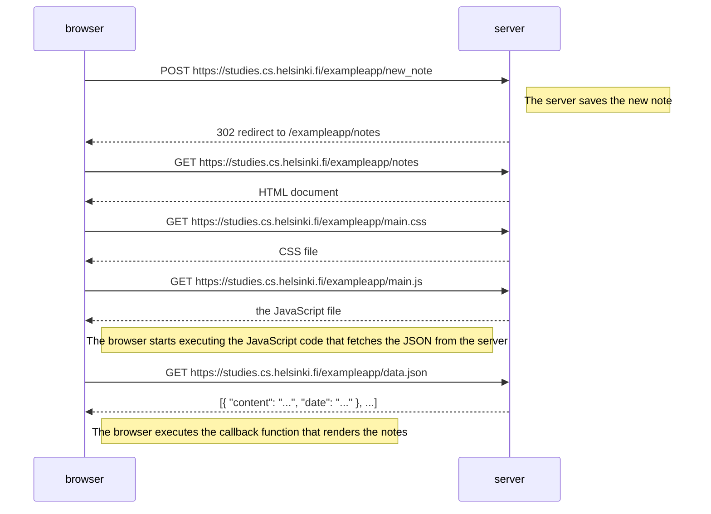
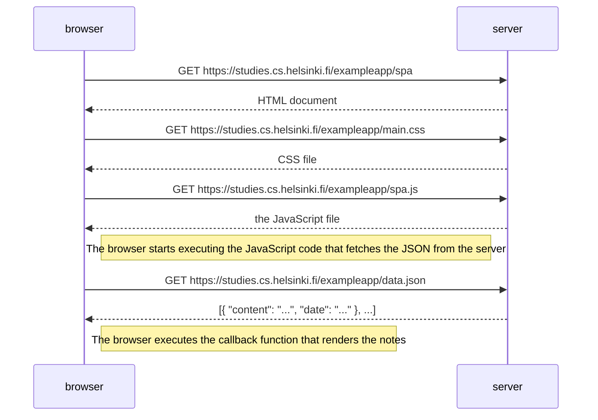
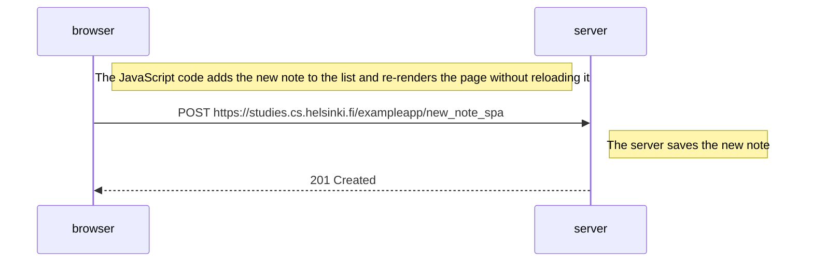

# Part 0

## 0.4: New note diagram

```mermaid
sequenceDiagram
    participant browser
    participant server

    browser->>server: POST https://studies.cs.helsinki.fi/exampleapp/new_note
    Note right of server: The server saves the new note
    server-->>browser: 302 redirect to /exampleapp/notes

    browser->>server: GET https://studies.cs.helsinki.fi/exampleapp/notes
    server-->>browser: HTML document

    browser->>server: GET https://studies.cs.helsinki.fi/exampleapp/main.css
    server-->>browser: CSS file

    browser->>server: GET https://studies.cs.helsinki.fi/exampleapp/main.js
    server-->>browser: the JavaScript file

    Note right of browser: The browser starts executing the JavaScript code that fetches the JSON from the server

    browser->>server: GET https://studies.cs.helsinki.fi/exampleapp/data.json
    server-->>browser: [{ "content": "...", "date": "..." }, ...]

    Note right of browser: The browser executes the callback function that renders the notes
```

## 0.5: Single page app diagram

```mermaid
sequenceDiagram
    participant browser
    participant server

    browser->>server: GET https://studies.cs.helsinki.fi/exampleapp/spa
    server-->>browser: HTML document

    browser->>server: GET https://studies.cs.helsinki.fi/exampleapp/main.css
    server-->>browser: CSS file

    browser->>server: GET https://studies.cs.helsinki.fi/exampleapp/spa.js
    server-->>browser: the JavaScript file

    Note right of browser: The browser starts executing the JavaScript code that fetches the JSON from the server

    browser->>server: GET https://studies.cs.helsinki.fi/exampleapp/data.json
    server-->>browser: [{ "content": "...", "date": "..." }, ...]

    Note right of browser: The browser executes the callback function that renders the notes
```

## 0.6: Single page app - New note diagram

```mermaid
sequenceDiagram
    participant browser
    participant server

    Note right of browser: The JavaScript code adds the new note to the list and re-renders the page without reloading it
    browser->>server: POST https://studies.cs.helsinki.fi/exampleapp/new_note_spa
    Note right of server: The server saves the new note
    server-->>browser: 201 Created
```